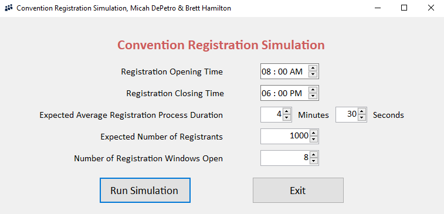
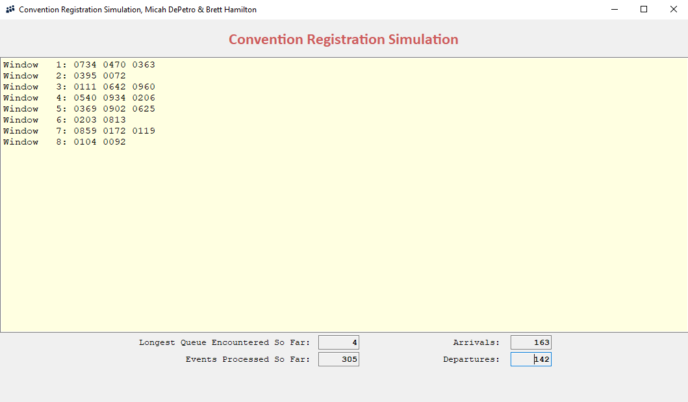
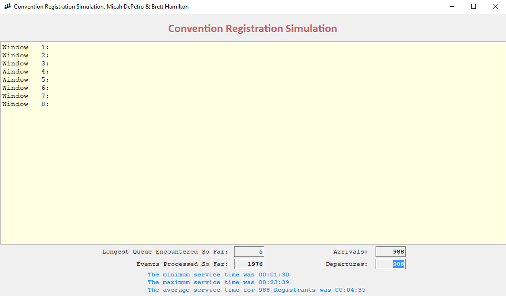

# Convention Registration Simulation
Convention registration simulator for Data Structures course project

## About
The goal of this project is to simulate a convention registration to optimize the number of windows necessary based on the expected number of registrants. In this case, the specifications noted 1,000 projected registrants. The number used in each simulation is based on a random number from a Poisson distribution centered around 1,000. Registrants are expected to arrive approximately uniformly throughout the registration time frame. The specifications also state that the average time for a person to register is 4 minutes and 30 seconds, with a minimum time of 30 seconds. The time it takes for each registrant to register is estimated using the negative exponential probability distribution. This project also implements Queue and PriorityQueue classes to handle the registration window lines.

## Demo Images
The numbered windows represent the registration windows open. The numbers represent the registrant objects' ID numbers and are meant to visually show the waiting lines moving.

After the simulation runs, it displays the relevant statistics such as minimum, maximum, and average time it took a registrant to complete their registration.

